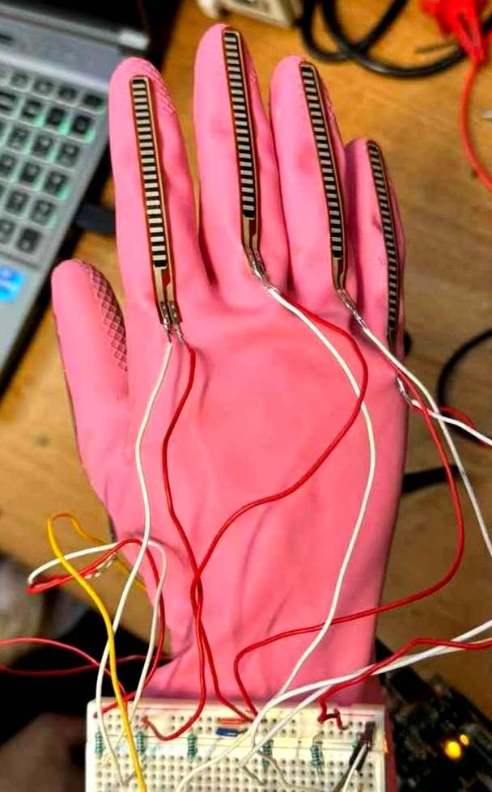
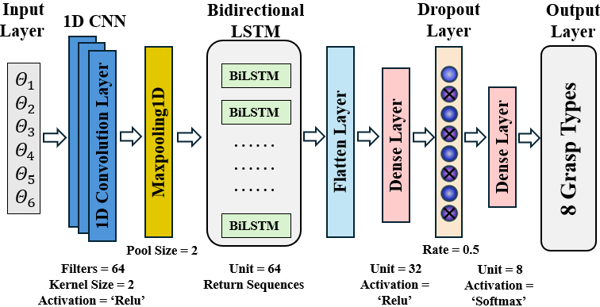
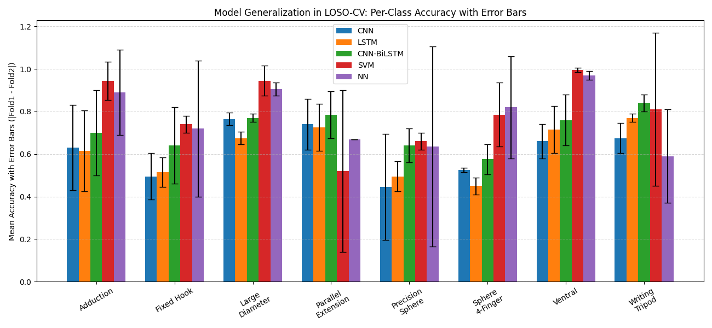

# AML LAB Project
Grasp Recognition using Flex Sensor Glove

This project presents a wearable glove system equipped with six flex sensors for real-time human grasp recognition. It classifies eight distinct grasp types using both sequential and static machine learning models. A total of 720 samples were collected from two participants, with different objects used to encourage generalization. The CNN-biLSTM model demonstrates the best cross-user performance under Leave-One-Subject-Out Cross-Validation (LOSO-CV).

---

## 🌐 System Design and Glove Prototype

  
  

> *Figure 1 & 2: Glove design with 6 flex sensors (5 fingers + 1 for thumb-index adduction).*

  

> *Figure 3: Circuit diagram showing voltage divider configuration for each sensor.*

---

## 📦 Data Collection

Data was collected using 8 grasp types (e.g., Precision Sphere, Fixed Hook, etc.) across various objects (pineapple, tennis ball, pen, tablet, etc.).

  

> *Figure 4: Everyday objects used for grasp trials.*

---

## 🧠 Model Architecture

We implemented two modeling strategies:
- **Sequential Approach**: CNN, LSTM, CNN-BiLSTM (10 time-step windows).
- **Static Approach**: Support Vector Machine (SVM), Fully Connected Neural Network (NN).

  

> *Figure 5: CNN-BiLSTM hybrid model structure.*

To ensure robustness across users, LOSO-CV was applied:

  

> *Figure 6: Cross-validation strategy (one subject for training, the other for testing).*

---

## 📊 Results and Insights

  

> *Figure 7: Per-class accuracy comparison of models (with error bars).*

The CNN-biLSTM model achieves the highest average accuracy and generalization, especially on ambiguous grasps like *Parallel Extension* and *Sphere 4-Finger*. SVM and NN perform well on clearly defined postures but show larger variance across users.

## 📥 Downloads

You can explore the project deliverables via the [Website folder](./Website):

- 🎥 [Demo Video](Website/video.mp4)  
- 🌐 [HTML Overview](Website/index.html)

---

## 🛠️ Authors & Credit

This project was completed as part of the AML Lab coursework at MUST.  
Special thanks to all team members and teaching staff for guidance.
